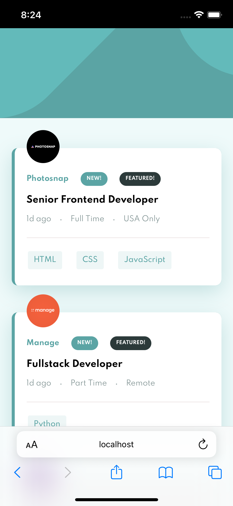
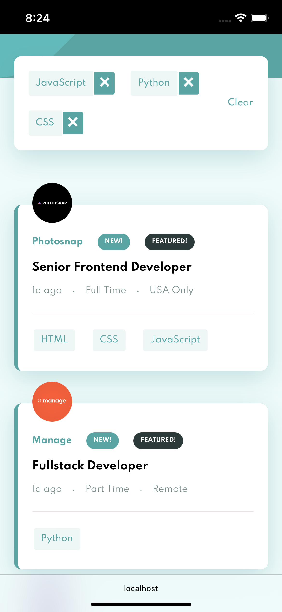
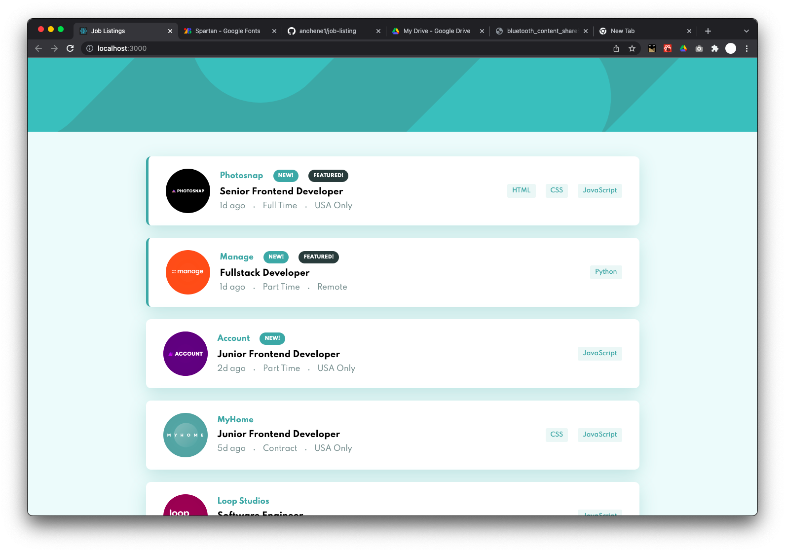
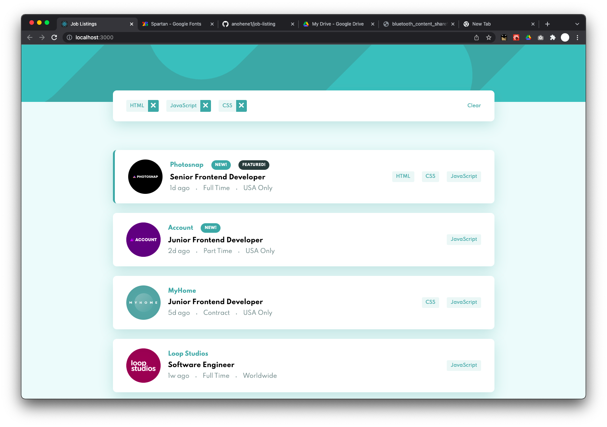

# Frontend Mentor - Job listings with filtering solution

This is a solution to the [Job listings with filtering challenge on Frontend Mentor](https://www.frontendmentor.io/challenges/job-listings-with-filtering-ivstIPCt). Frontend Mentor challenges help you improve your coding skills by building realistic projects. 

## Table of contents

- [Overview](#overview)
  - [The challenge](#the-challenge)
  - [Screenshot](#screenshot)
  - [Links](#links)
- [My process](#my-process)
  - [Built with](#built-with)
- [Author](#author)

## Overview

### The challenge

Users should be able to:

- View the optimal layout for the site depending on their device's screen size
- See hover states for all interactive elements on the page
- Filter job listings based on the categories

### Screenshot

<table>
  <tr>
    <td>

    </td>
    <td>

</td>
  </tr>
  <tr>
    <td>

    </td>
    <td>

</td>
  </tr>
</table>

### Links

- Solution URL: [https://www.frontendmentor.io/solutions/job-listings-with-filtering-2xonmVQjU](https://www.frontendmentor.io/solutions/job-listings-with-filtering-2xonmVQjU)
- Live Site URL: [https://job-listing-614.netlify.app/](https://job-listing-614.netlify.app/)

## My process

### Built with

- CSS custom properties
- Flexbox
- CSS Grid
- [React](https://reactjs.org/) - JS library

## Author

- Website - [Isaac Anohene](https://anohene1.github.io)
- Frontend Mentor - [@anohene1](https://www.frontendmentor.io/profile/anohene1)
- Twitter - [@anohene1](https://www.twitter.com/anohene1)

